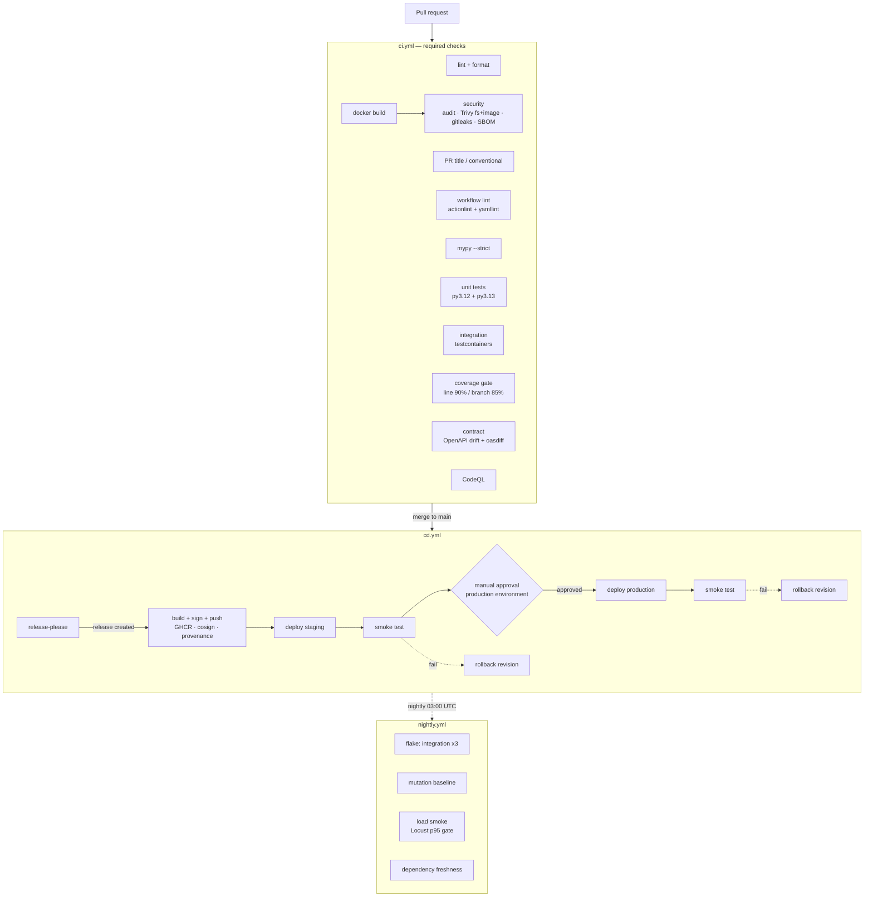

# CI/CD — annotated walkthrough

Why this exists: this is the map of every automated gate in `appointments-api`. For each job it says
what it runs and — more importantly — **what real failure it prevents**. If you are debugging a red
pipeline, find the job here first.

There are three workflows:

| File | Trigger | Purpose |
|---|---|---|
| `.github/workflows/ci.yml` | pull request, push to `main` | The per-PR quality gate. Fast, everything required. |
| `.github/workflows/cd.yml` | push to `main` | Release, build, sign, deploy. |
| `.github/workflows/nightly.yml` | 03:00 UTC + manual | Slow checks: flake, mutation, load, dep freshness. |

Shared conventions: every workflow sets a `concurrency` group, a top-level minimal `permissions:`
block (jobs widen their own only where needed), `timeout-minutes` on every job, dependency caching
keyed on `uv.lock`, and a `workflow_dispatch` trigger so it can be run by hand. Dependency install is
factored into a composite action, `.github/actions/setup-python-uv`, so no job copy-pastes the four
uv steps.

---

## The pipeline at a glance

---

## `ci.yml`, job by job

### `lint` — ruff check + format
Style and a large class of bugs (unused imports, shadowed names, mutable defaults, un-awaited
coroutines from the `ASYNC` rules). **Prevents:** noisy diffs and a category of real async mistakes
from ever reaching review.

### `commitlint` — PR title is a Conventional Commit
A regex check on the PR title. **Prevents:** a malformed title breaking the auto-generated changelog,
because `release-please` derives release notes from titles. No third-party action — just bash.

### `workflow-lint` — actionlint + yamllint
`actionlint` type-checks the workflow files (bad `needs:`, undefined `${{ }}` context, shell typos in
`run:` blocks); `yamllint` checks formatting against `.yamllint.yml`. **Prevents:** a workflow that is
itself broken — the failure mode where "the pipeline that checks the code" is the thing that is wrong.

### `typecheck` — `mypy --strict`
`--strict` on the whole `src` + `tests` tree. **Prevents:** the drift between what a function claims to
take and what it actually takes — the bug integration tests find late and unit tests miss.

### `test-unit` — matrix py3.12 + py3.13
The I/O-free unit suite on both interpreters, with coverage XML and JUnit XML uploaded as artifacts.
**Prevents:** logic regressions, and a version-specific break before we adopt 3.13. Fast because it
touches no database or network.

### `test-integration` — testcontainers
Spins up **real Postgres and Redis** and runs the integration suite. **Prevents:** the bugs that only
exist against a real database — the double-booking exclusion constraint, keyset pagination stability,
refresh-token rotation in Redis. See `docs/TESTING.md` for why we do not substitute SQLite.

### `coverage` — the gate
Runs unit + integration + security + property under one coverage run and enforces **line ≥ 90% /
branch ≥ 85% on `services/` and `api/`** via `scripts/check_coverage.py`. HTML report uploaded.
**Prevents:** new code paths shipping with no test exercising them. (Coverage is necessary, not
sufficient — that is what the nightly mutation gate is for.)

### `contract` — OpenAPI drift + `oasdiff`
Fails if the schema the app serves has drifted from the committed `contracts/openapi.json`, and runs
`oasdiff` to fail the PR on a **breaking** API change unless it is labeled `breaking-change`. Publishes
`openapi.json` as a build artifact. **Prevents:** the web app's generated client silently going stale,
and a breaking API change shipping without a deliberate decision. See `docs/CONTRACT_WORKFLOW.md`.

### `build` — Docker image
Builds the multi-stage image with BuildKit and the GitHub Actions cache, loads it, and saves it as an
artifact for the security job. **Prevents:** a Dockerfile that no longer builds — caught here, not at
deploy time.

### `security` — audit, scan, secrets, SBOM
Runs `pip-audit` (known CVEs in dependencies), `gitleaks` (secrets in the full history), **Trivy** on
the filesystem and on the built image (fails on HIGH/CRITICAL, fixable only), and generates a
**CycloneDX SBOM** from the image, uploaded with 90-day retention. **Prevents:** shipping a known-
vulnerable dependency or base image, or a leaked credential, and gives a bill of materials for audit.

### `codeql` — static security analysis
GitHub's CodeQL with the `security-and-quality` query pack. **Prevents:** injection and data-flow
classes of bug that lint does not model. Uploads results to the Security tab (needs
`security-events: write`).

---

## `cd.yml`, stage by stage

1. **`release`** — `release-please` maintains a release PR from the commit history. When that PR
   merges, it tags a semver release and reports `release_created=true`. Only then do the later jobs
   run. On an ordinary push, nothing is released and the deploy jobs are simply not needed.
2. **`build-sign-push`** — builds the release image, pushes to GHCR tagged `semver` + full SHA +
   `latest`, **signs it keylessly with cosign** (GitHub OIDC — no key to store), and attaches a
   **provenance attestation**. Uses only the built-in `GITHUB_TOKEN` and OIDC, so it works on a fresh
   repo with zero configured secrets.
3. **`deploy-staging`** — Azure login via OIDC, run the **migration Job** (expand phase), roll the new
   revision, then **smoke-test** `/health/ready` + one booking flow. On smoke failure it reactivates
   the previous revision. Guarded by `vars.DEPLOY_ENABLED`.
4. **`deploy-production`** — same steps against production, gated behind the `production` GitHub
   Environment's **required-reviewers** rule, so it pauses for a human approval.

See `docs/DEPLOYMENT.md` for the OIDC trust policy, the expand/contract migration strategy, and the
rollback details.

---

## `nightly.yml`

- **`flake`** — the integration suite three times in a row; any single failure fails the job. A test
  that only sometimes passes is a defect, not luck.
- **`mutation`** — `mutmut` on `services/`, enforced against the documented baseline
  (`scripts/check_mutation.py`). Heavier than a PR gate, so it runs nightly (this matches the spec's
  nightly split). Answers "do the tests actually detect wrong behaviour, or just execute the lines?"
- **`load`** — brings up the composed stack, runs a small **Locust** scenario, and fails if p95
  latency exceeds the budget (`scripts/check_load.py`). A smoke-level performance guard, not a
  benchmark.
- **`deps`** — an informational outdated-dependency report to the job summary. Never fails the build.

---

## Verifying the pipeline locally

Every PR gate has a matching `make` target so the exact commands run the same locally and in CI:

| Gate | Local command |
|---|---|
| lint | `make lint` |
| workflow lint | `make lint-workflows` (actionlint + yamllint) |
| typecheck | `make typecheck` |
| unit | `make test` |
| integration | `make test-integration` (needs Docker) |
| coverage gate | `make coverage` (needs Docker) |
| contract drift | `make contract-check` |
| contract breaking | `make contract-diff` (needs oasdiff) |
| build | `make build` |
| image + fs scan | `make scan` (needs Trivy) |
| SBOM | `make sbom` (needs Trivy) |
| load | `make load` (needs Docker) |
| smoke | `make smoke BASE_URL=...` |

`make ci-local` runs lint + workflow-lint + typecheck + the coverage gate — the fast core of the PR
set.

### `act` and what it cannot run

You can run the pure-compute jobs under [`act`](https://github.com/nektos/act), e.g.
`act pull_request -j lint` or `-j typecheck`. The following **cannot** run under `act` and must be
verified on GitHub, because they depend on the real GitHub/cloud control plane:

- **`build-sign-push`** — cosign keyless signing and provenance need GitHub's OIDC token endpoint.
- **GHCR push** — needs a real registry and `GITHUB_TOKEN` with `packages: write`.
- **`deploy-*`** — need Azure OIDC federation and a real subscription.
- **`codeql`** — uploads to GitHub code scanning.
- Jobs using **testcontainers** (`test-integration`, `coverage`) run under `act` only if the `act`
  image has a working Docker daemon; the simpler path is `make test-integration` directly.

### Runners: testcontainers vs `services:`

CI uses **testcontainers** — the test code starts Postgres and Redis itself, so the exact same code
brings up dependencies locally and in CI, with per-test lifecycle control. The alternative is GitHub
Actions `services:` containers, which start before the job and are simpler but static (fixed version,
no per-test control, and the test must wait on readiness itself). We chose testcontainers because the
integration tests need to control container lifecycle (e.g. a fresh DB per concurrency test); the
`services:` approach is a fine choice for a suite that just needs "a database is there".

> GitHub-hosted runners have a clean TLS path. The corporate-CA handling in `docs/CORPORATE_NETWORK.md`
> applies to local builds only.
