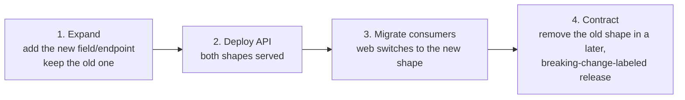

# Contract workflow

Why this exists: `appointments-api`, `appointments-web`, and `aurora-sensor-agent` are three
independently deployed repos. The only thing that keeps them working together is their **contracts**.
This document explains the HTTP contract (OpenAPI) that this repo owns, how CI stops it from drifting,
and how to roll out a breaking change across repos that ship on their own schedules.

There are two contracts in the system, flowing in opposite directions:

1. **HTTP / OpenAPI** — owned by `appointments-api` (this repo). The web app consumes it.
2. **Telemetry / AsyncAPI + JSON Schema** — owned by `aurora-sensor-agent`. This API consumes it.
   That half arrives in a later milestone; this document is about the OpenAPI half.

## The rule

`contracts/openapi.json` is the source of truth for the HTTP contract. It is generated from the app,
committed to the repo, and consumed by the web app. Two gates protect it:

- **Drift gate** (`tests/contract/`, runs on every PR): the schema the app serves must be
  byte-identical to `contracts/openapi.json`. Change the API without regenerating the file and the
  build fails. Fix: `make contract`.
- **Breaking-change gate** (`oasdiff`, runs on every PR): the new schema is compared against the base
  branch's committed schema. A breaking change (a removed path, a removed field, a tightened type, a
  new required request field, …) fails the PR — **unless** the PR is labeled `breaking-change` and the
  version is bumped.

## Making an API change

```mermaid
sequenceDiagram
    actor Dev
    participant API as appointments-api
    participant CI
    participant Web as appointments-web

    Dev->>API: change a router / schema
    Dev->>API: make contract  (regenerate contracts/openapi.json)
    Dev->>CI: open PR
    CI->>CI: drift gate — served == committed?
    CI->>CI: oasdiff — breaking vs base?
    alt non-breaking
        CI-->>Dev: green, merge
    else breaking, unlabeled
        CI-->>Dev: red — label breaking-change + bump version
    end
    Note over API,Web: on merge, CI publishes openapi.json as an artifact
    Web->>API: vendor contracts/openapi.json
    Web->>Web: regenerate client types; CI fails if generated output drifts
```

Everyday flow: edit the API, run `make contract`, commit the regenerated file, open the PR. The diff on
`contracts/openapi.json` should describe exactly your change and nothing else (the file is generated
deterministically, so there is no formatting noise). Check it locally the way CI does:

```bash
make contract-check   # served == committed
make contract-diff    # breaking changes vs origin/main (needs oasdiff)
```

## Rolling out a breaking change across three repos

The three repos deploy independently, so you can never assume the API and its consumers change at the
same instant. Treat the contract like a database schema: **expand, migrate, contract** — never a hard
rename.



1. **Expand.** Add the new field or endpoint alongside the old one. This is non-breaking, so it passes
   `oasdiff` and ships normally. Mark the old shape `deprecated: true` in the schema.
2. **Deploy the API.** Now both the old and new shapes are served, so every consumer keeps working.
3. **Migrate consumers.** The web app moves to the new shape and ships on its own schedule. Because the
   API still serves the old shape, there is no flag day.
4. **Contract.** Once no consumer uses the old shape, remove it in a PR labeled `breaking-change` with
   a major version bump. `oasdiff` will flag the removal; the label is the deliberate acknowledgement.

This is the same discipline as the database expand/contract migrations in `docs/DEPLOYMENT.md`, applied
to the API surface instead of the schema. A rename is never one step; it is add → deprecate → migrate →
remove, spread across releases.

## Why oasdiff, not a hand-written check

`oasdiff` understands OpenAPI semantics — it knows that adding an optional field is safe but adding a
required request field is breaking, that widening an enum is safe but narrowing it is not. A textual
diff cannot tell those apart, and a hand-rolled checker would reimplement a spec badly. The same
binary and command run locally (`make contract-diff`) and in CI, so there are no surprises at review
time.
