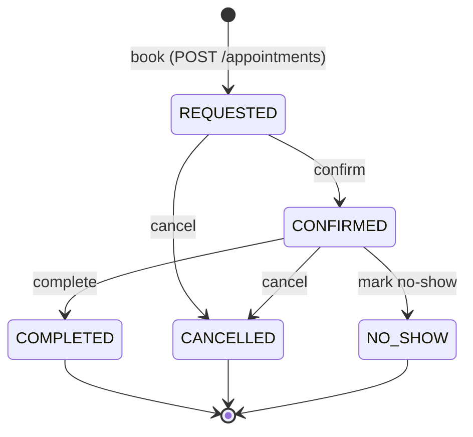
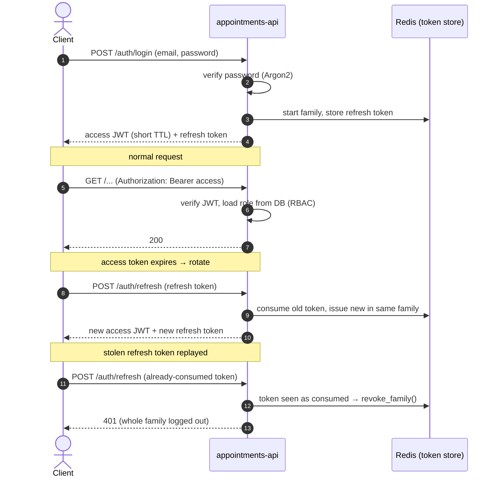
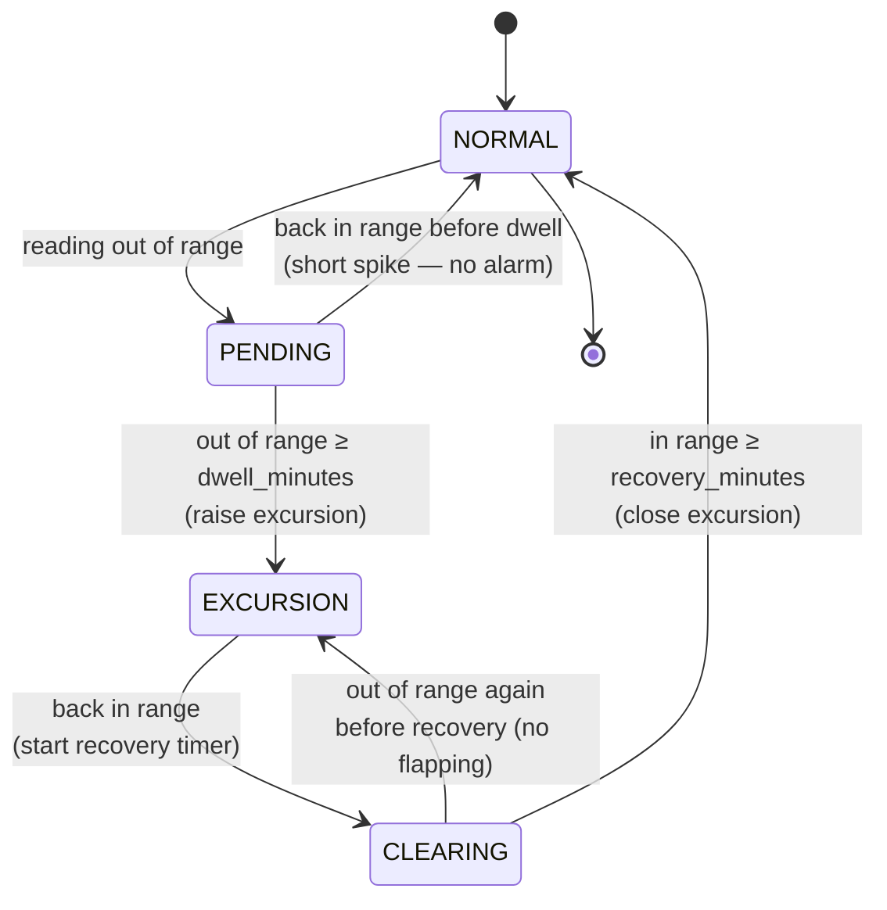

# Diagrams — the visual model

One page with the pictures that explain the backend. All diagrams are **Mermaid**, so they render
on GitHub with no external image service and never break behind a restricted network.

The system-level picture (all three repos and how telemetry flows between them) lives in the
[top-level `README.md`](../../README.md). This page is the backend's own state machines and flows,
plus links to the diagrams that already live next to the code they describe.

- [Appointment state machine](#appointment-state-machine) — new here
- [Authentication and refresh-token rotation](#authentication-and-refresh-token-rotation) — new here
- [Excursion state machine](#excursion-state-machine) — new here (shared with the device)
- [Telemetry data path](TELEMETRY.md#data-path) — sensor → agent → MQTT → API → SSE → UI
- [CI/CD pipeline](CI_CD.md) — what runs on a PR and on a push to `main`
- [Contract workflow](CONTRACT_WORKFLOW.md) — how an OpenAPI change rolls out across the repos

---

## Appointment state machine

An appointment moves through a small, fixed set of states. The rules live as **data** in
`services/appointments/state_machine.py` (a `dict` of allowed moves), not as a pile of
`if`-statements, so they are easy to read and to test exhaustively.

What the tests prove around this diagram:

- **Any arrow not drawn is a `409`.** `NO_SHOW` from `REQUESTED`, `COMPLETED` from `CANCELLED`, and
  every other move outside the table raise `IllegalTransitionError`, which the API turns into
  `409 Conflict`.
- **`NO_SHOW` is only reachable from `CONFIRMED`** — you cannot no-show an appointment nobody
  confirmed.
- **Every transition is guarded by `ETag` / `If-Match`.** Two people acting on the same appointment
  race safely: the second gets `412 Precondition Failed` because their `ETag` (derived from the row's
  `version`) is stale.
- **Cancellation is also an authorization rule.** A `PATIENT` cancelling later than the clinic's
  cutoff window is rejected; a `CLINIC_ADMIN` is allowed. The state move is legal for both — the
  business rule is a separate layer on top.

## Authentication and refresh-token rotation

Access tokens are short-lived JWTs. Refresh tokens are **opaque random strings** (not JWTs), stored
in Redis, so they can be revoked. Each login starts a token **family**; every refresh consumes the
presented token and issues a new one in the same family. Presenting a token that was already
consumed — the classic sign of a stolen token being replayed — **revokes the whole family**.

Why it is built this way: opaque refresh tokens can be revoked (a JWT cannot be, before it expires);
single-use rotation plus family revocation means a leaked refresh token is usable at most once before
the reuse is detected and the attacker **and** the real user are logged out. The role is read from
the database on every request, so a tampered JWT claiming `PLATFORM_ADMIN` still cannot escalate.

## Excursion state machine

A cold-chain breach is not "one reading was too warm" — a fridge door opening for ten seconds must
**not** alarm. The rule: temperature outside `[min, max]` continuously for longer than
`dwell_minutes` raises an excursion; it clears only after the value is back in range for
`recovery_minutes`.

The server runs this engine (`services/telemetry/excursion.py`) over the stored series, and the
device runs the same rule locally (`aurora-sensor-agent`). A **shared fixture set**
(`tests/fixtures/excursions/cases.json`) is run against both, and they must agree — that is the
contract that lets the device and the server be trusted to reach the same verdict.

Notes the tests pin down:

- **`PENDING → NORMAL`** is the door-open case: a short spike never raises an alarm.
- **`CLEARING → EXCURSION`** stops an open excursion flapping closed the instant the temperature dips
  back for a single reading.
- The engine is **order-independent**: after every ingested batch the server re-derives the whole
  series from `measured_at`, so a late backfill that fills a gap still produces the right excursion.
- The clock is **injected**, never `datetime.now()`, so the dwell and recovery timers are tested
  deterministically (and a backward clock jump cannot invent an excursion).
