# Telemetry ingestion (milestone 10)

How cold-chain readings get from a device into the API, become excursions, and reach the dashboard.
Every rule below has a test; the shared excursion fixtures are the contract between this service and
the device.

## Data path

```mermaid
flowchart LR
    subgraph Device["aurora-sensor-agent"]
        S[SHT4x sensor] --> AG[agent loop]
        AG --> BUF[(SQLite buffer)]
        BUF --> BAT[batch + idempotency key]
    end
    BAT -->|MQTT primary| BR{{Mosquitto broker}}
    BAT -->|HTTP fallback| HB["POST /devices/&#123;id&#125;/telemetry:batch"]
    BR --> MW[MQTT worker]
    MW --> ING[TelemetryIngestionService]
    HB --> ING
    ING --> DB[(PostgreSQL<br/>telemetry_readings + BRIN)]
    ING --> EX[excursion engine]
    EX --> EXDB[(excursions)]
    ING --> STR[[Redis Stream]]
    STR --> SSE["GET /streams/telemetry (SSE)"]
    SSE --> UI[web dashboard]
    DB --> TS["GET /devices/&#123;id&#125;/telemetry?bucket=&agg="]
    TS --> UI
```

The MQTT worker and the HTTP endpoint are two mouths on the **same** `TelemetryIngestionService`
(assembled once in `telemetry_wiring.build_ingestion_service`), so one test suite covers both paths.

## The three ingestion guarantees (spec §4 rules 9–10)

- **Idempotent** — a reading is keyed by `(device_id, sequence)`, enforced by a unique constraint.
  Duplicates (within a batch, across a retried batch, or racing a concurrent batch) are dropped via
  `INSERT ... ON CONFLICT DO NOTHING`, and each item's fate is reported in the per-item result array.
- **Order-independent** — nothing assumes arrival order. After every batch the excursion engine
  re-derives the whole series from `measured_at`, so a late backfill that fills a gap is still
  evaluated. Tests post a sparse series (no excursion), then backfill out of order (excursion raised).
- **Clock-skew aware** — a reading whose `measured_at` is further than the allowed skew from the
  server clock is stored but **flagged** (`clock_skew_flagged`); one dated beyond a small future
  tolerance is **rejected** and never stored.

## Excursions are re-derived server-side

The server does not trust the device's alarm; it runs the **same** dwell/recovery state machine over
the stored series (`services/telemetry/excursion.py`, a faithful port of the device's
`logic.excursion`). The two are held to a **shared fixture set**
(`tests/fixtures/excursions/cases.json`, vendored byte-identical from the device repo) — see ADR 0014.
Excursions are keyed by `(device_id, started_at)` so re-derivation upserts rather than duplicating and
preserves an acknowledgement.

## Storage, downsampling, and retention (spec §5, no TimescaleDB)

- Readings live in plain PostgreSQL. `measured_at` carries a **BRIN** index — telemetry is
  append-heavy and time-clustered, so a block-range index gives cheap time-window scans at a fraction
  of a b-tree's size. A b-tree on `(device_id, measured_at)` serves the per-device series read.
- **Downsampling is on-read**: `GET /devices/{id}/telemetry?bucket=5m&agg=avg|min|max` aggregates
  with `date_bin` against a fixed epoch, so buckets align the same way for every query and there is no
  second rollup table to keep in sync.
- **Retention is a scheduled job**: `scripts/retention.py` (`make retention`) deletes raw readings
  older than `TELEMETRY_RETENTION_DAYS` (default 90) in chunks, keeping the table and its BRIN index
  bounded. Excursions are stored separately, so pruning raw readings never loses a recorded breach.

## Live stream (SSE)

`GET /streams/telemetry` pushes each accepted reading as it lands, backed by a Redis Stream. The
stream id is the SSE event id, so reconnection is standard: the browser resends `Last-Event-ID`, and
the server replays the missed entries (`XRANGE`) before following live (`XREAD BLOCK`). Note:
`EventSource` cannot send an `Authorization` header, so a production dashboard fronts this with a
cookie/session or a short-lived token; the endpoint uses bearer auth here (wiring the browser
transport is milestone 12).

## Authentication

Devices posting telemetry present a per-device secret (`X-Device-Secret`), issued once at provisioning
and rotatable; only its Argon2 hash is stored. The read/manage endpoints use the normal user JWT with
clinician/admin roles. Over MQTT the broker's ACLs bind a device to its own topic, so the device id is
taken from the topic, not the (untrusted) payload body.

## The telemetry contract

The device repo owns the contract (AsyncAPI 3 + a JSON Schema for the batch envelope). This API
vendors it into `appointments_api/contracts/telemetry/`, validates every inbound MQTT message against
it, and CI fails on drift — the OpenAPI gate in reverse. Payloads carry a version; the API accepts the
current version and the previous one (a v1 payload just omits `battery_pct`), proven by a test. See
`docs/CONTRACT_WORKFLOW.md` and ADR 0014.
